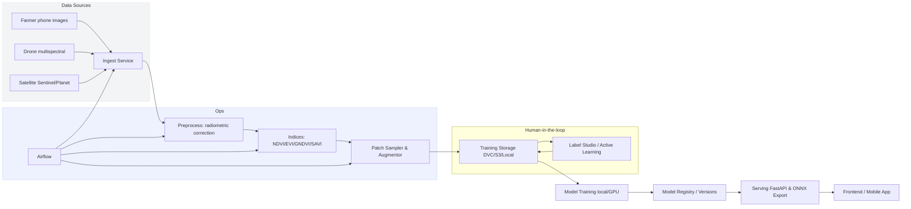
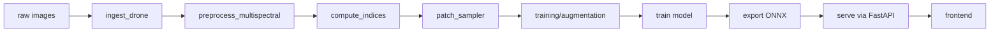
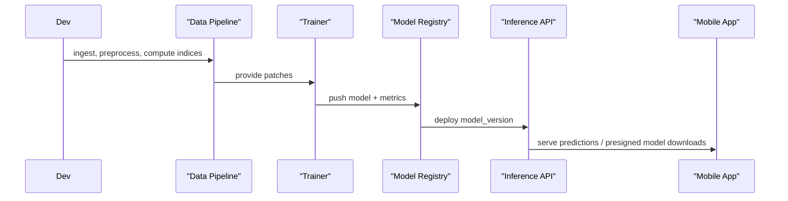
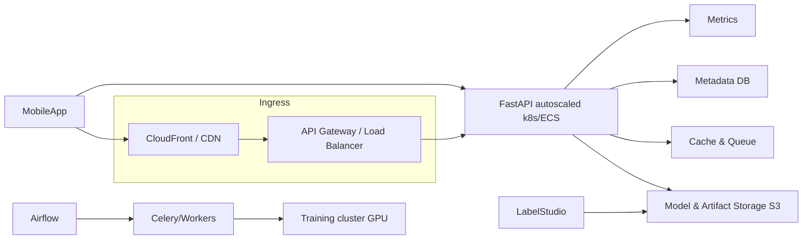

# PastureAI

> **Real-time biomass estimation for sustainable grazing** — an end-to-end AI platform that turns pasture imagery (phone, drone, satellite) into actionable insights for farmers, researchers, and land managers.

[](https://github.com/lucylow/PastureAI/actions/workflows/ci.yml)
[](https://opensource.org/licenses/MIT)
[](https://nodejs.org)
[](https://www.python.org/downloads/)

---

## Table of Contents

- [Project Summary](#project-summary)
- [Motivation & Goals](#motivation--goals)
- [Features](#features)
- [Quick Start](#quick-start)
- [Architecture](#architecture)
- [Project Structure](#project-structure)
- [Synthetic Dataset Generator](#synthetic-dataset-generator)
- [Data Pipeline](#data-pipeline---ingestion--preprocess--indices--patches)
- [Model Training & Orchestration](#model-training--orchestration)
- [Model Serving & Inference API](#model-serving--inference-api)
- [Frontend & UX](#frontend--ux)
- [Active Learning](#active-learning)
- [Edge & ONNX Export](#edge--onnx-export)
- [Deployment & Infrastructure](#deployment--infrastructure)
- [DVC & Data Versioning](#dvc--data-versioning)
- [Testing & CI](#testing--ci)
- [Performance & Optimization](#performance--optimization)
- [Roadmap](#roadmap)
- [Contributing](#contributing)
- [Appendix: Useful Commands](#appendix-useful-commands)
- [License](#license)

---

## Project Summary

**PastureAI** is designed to help farmers, researchers, and land managers estimate pasture biomass and health from imagery (phone, drone, or satellite). The platform provides:

- **Deterministic demo predictor** — Fast reproducible demos with interpretable outputs.
- **Data pipelines** — Multispectral and RGB ingestion, preprocessing, and vegetation index computation.
- **Vegetation indices** — NDVI, EVI, GNDVI, SAVI computation and tile/patch summarization.
- **Patch sampler & augmentor** — ML-ready training data with configurable sampling strategies.
- **Model training orchestration** — sklearn and PyTorch support with ONNX export for edge deployment.
- **FastAPI inference endpoints** — Production-ready API with a React/Next.js demo UI.
- **Active learning loop** — Label Studio integration for efficient human-in-the-loop labeling.
- **Operational tooling** — Docker Compose, Airflow DAGs, DVC hints, and unit tests.

This README documents how the pieces fit together and provides technical diagrams, run commands, code snippets, and design rationale.

---

## Motivation & Goals

**Problem:** Most pasture biomass estimation methods are destructive (cutting and weighing) or expensive (specialized sensors). Farmers need frequent, low-cost, trustworthy estimates to make grazing and harvest decisions.

**Goals for PastureAI (hackathon edition):**

- Deliver a reproducible, demo-friendly, end-to-end pipeline that judges can run locally.
- Provide a sensible path toward production: data versioning (DVC), orchestration (Airflow), and model export (ONNX) for edge.
- Embrace interpretability: deterministic predictor for demos, explainable features, and model metadata.

---

## Features

| Feature | Description |
|---------|-------------|
| **Image2Biomass Pipeline** | Raw imagery → biomass metrics with per-tile uncertainty |
| **Multispectral Analysis** | Vegetation indices (NDVI, EVI, GNDVI, SAVI) computation and tile summarization |
| **Deterministic Mock Predictor** | Interpretable baseline for demos and UI/UX validation |
| **Active Learning** | Uncertainty sampling for human-in-the-loop labeling |
| **Production Orchestration** | Airflow DAGs for ingestion and preprocessing |
| **Edge Deployment** | ONNX export for mobile and edge devices |

---

## Quick Start

### Prerequisites

- **Node.js** 20+
- **Python** 3.10+
- **Docker** (optional, for containerized setup)

### Option 1: Demo (Fastest)

```bash
git clone https://github.com/lucylow/PastureAI.git
cd PastureAI

# Backend: install deps & generate mock data
bash scripts/create_demo_env.sh

# Start API
uvicorn app.main:app --reload --port 8000

# In another terminal: start frontend
npm install
npm run dev
```

Then open **http://localhost:3000** (or the port shown by Next.js).

For a minimal Python-only demo, you can also run:

```bash
python -m venv .venv
source .venv/bin/activate  # Windows: .venv\Scripts\activate
pip install -r requirements.txt
python mock_data/generate_synthetic_dataset.py --n 200
uvicorn app.main:app --reload --port 8000
```

Then open `app/demo/frontend/index.html` in your browser or serve it statically.

### Option 2: Image2Biomass (Full Pipeline)

```bash
# 1. Start inference server
cd inference_server && pip install -r requirements.txt
uvicorn app.main:app --reload --port 8000

# 2. In another terminal: start frontend
npm install
npm run dev

# 3. Open biomass demo
# → http://localhost:3000/pasture/demo
```

See **[IMAGE2BIOMASS_QUICKSTART.md](IMAGE2BIOMASS_QUICKSTART.md)** for full setup and model training.

### Option 3: Docker

```bash
docker-compose -f docker-compose-demo.yml up
# or for full Image2Biomass:
docker-compose -f docker-compose-image2biomass.yml up
```

---

## Architecture

### High-Level Data Flow



### Data Pipeline DAG



### Train → Serve → Edge



### Deployment Infrastructure



---

## Project Structure

```
/
├── app/
│   ├── main.py                 # FastAPI app entry
│   ├── api/
│   │   └── v1/
│   │       ├── biomass.py      # production inference hooks
│   │       └── mock/
│   │           └── predict/   # demo endpoints
│   ├── mock_inference/
│   │   └── mock_predictor.py   # deterministic predictor
│   └── demo/
│       └── frontend/           # static demo frontend (index.html + app.js)
├── inference_server/           # Image2Biomass FastAPI inference service
├── data_pipeline/
│   ├── ingest_drone.py
│   ├── compute_indices.py
│   ├── patch_sampler.py
│   ├── active_learning.py
│   ├── cli.py                  # CLI for ingest, indices
│   └── ...
├── models/                     # PyTorch U-Net training and export
├── training/
│   └── train_embeddings_and_regressor.py
├── tools/
│   ├── export_onnx.py
│   └── export_onnx_pipeline.py
├── mock_data/
│   └── generate_synthetic_dataset.py
├── airflow/
│   └── dags/
├── scripts/
│   └── create_demo_env.sh
├── tests/
├── docker-compose-demo.yml
├── docker-compose-image2biomass.yml
├── README.md
└── IMAGE2BIOMASS_QUICKSTART.md
```

---

## Synthetic Dataset Generator

`mock_data/generate_synthetic_dataset.py` creates a labeled, synthetic dataset for demos and model sanity checks:

- **Images:** Generated with green blobs (alive grass), dead (yellow) patches, and clover patches.
- **Labels:** `dry_green_g`, `dry_dead_g`, `dry_clover_g`, `gdm_g`, `dry_total_g`, `coverage_pct`, `pasture_health`.

Example CSV schema:

```csv
image_path,dry_green_g,dry_dead_g,dry_clover_g,gdm_g,dry_total_g,coverage_pct,pasture_health
images/img_0000.png,600.24,75.10,18.66,693.99,693.99,65.32,good
```

**Usage:**

```bash
python mock_data/generate_synthetic_dataset.py --n 500
```

This dataset is ideal for UI demos, model sanity checks, and testing the patch sampler and training scripts without needing real-world sensor calibration.

---

## Data Pipeline — Ingestion → Preprocess → Indices → Patches

### 1) Ingestion (`data_pipeline/ingest_drone.py`)

- Scans source directories for `jpg|jpeg|png|tif|tiff`.
- Extracts EXIF: timestamp, GPS lat/lon/altitude, camera model, lens.
- Writes a catalog (e.g. `catalog.parquet`) with metadata and preview images.
- Optional S3 upload (via boto3) and MD5 checksuming/dedup.

**Design:** Metadata-first approach — the catalog is the source of truth. Each row stores `image_path`, `preview_path`, `timestamp`, `gps_lat`, `gps_lon`, `gps_alt`, `camera_model`, `s3_key`, and `checksum`. Parquet is used for compact, fast reads.

### 2) Index Computation (`data_pipeline/compute_indices.py`)

- Reads multispectral GeoTIFFs (rasterio), computes NDVI, EVI, GNDVI, SAVI.
- Writes each index as a single-band GeoTIFF.
- Produces tile-level summary stats (mean, median, std, coverage_pct).

**Formulas:**

- NDVI: `(NIR - RED) / (NIR + RED + eps)`
- EVI: `2.5 * (NIR - RED) / (NIR + 6*RED - 7.5*BLUE + 1)`

### 3) Patch Sampling (`data_pipeline/patch_sampler.py`)

- Sliding-window patch extraction with configurable `patch_size` and `stride`.
- Exports patches to compressed NPZ with patch array and meta dict.
- Supports NDVI-based binning and class-balanced sampling for training.

**Why patches?** Training on many small patches increases effective dataset size, makes augmentation easier, and helps models focus on local texture and color patterns relevant to biomass.

---

## Model Training & Orchestration

### Training Approaches

**Classical (baseline):**

- Compute embeddings (e.g. global patch statistics or pretrained vision encoder embeddings).
- Train scikit-learn regressors (RandomForest, GradientBoosting) per-target or multi-output.
- Advantages: fast to train, easy to interpret, robust on small datasets.

**Deep learning:**

- Fine-tune a vision encoder (DINOv2, ViT, EfficientNet) to regress biomass targets or predict vegetation maps.
- Use patch-level augmentation and MixUp or multi-task heads (biomass regression + health classification).
- Save best checkpoints and export regression head to ONNX for edge.

### Orchestration

`training/train_embeddings_and_regressor.py`:

- Reads labels CSV or catalog.
- Computes embeddings for each image/patch using a pretrained transformer or helper.
- Optionally applies PCA/PLS/GMM features.
- Trains per-target regressors and saves artifacts (joblib or pth).

### Evaluation Metrics

- **Regression:** MAE, RMSE, R² per-target (Dry_Green_g, Dry_Dead_g, Dry_Clover_g, Dry_Total_g).
- **Aggregate:** MAPE for farm-level estimates.
- **Calibration:** Compare predicted biomass density (g/m²) with ground-truth destructive samples where available.

---

## Model Serving & Inference API

Serving uses **FastAPI** with two modes:

1. **Demo Mock Predictor** (`/api/v1/mock/predict`) — Deterministic heuristic mapping from simple image statistics (mean green, coverage).
2. **Production Predictor** (`/api/v1/biomass/predict`) — Loads PyTorch/ONNX model and returns full multi-target predictions.

### API Contract: `/api/v1/mock/predict` (POST)

**Request:** `multipart/form-data` with `file` image.

**Response:**

```json
{
  "predictions": {
    "Dry_Green_g": 523.12,
    "Dry_Dead_g": 75.34,
    "Dry_Clover_g": 12.45,
    "GDM_g": 610.91,
    "Dry_Total_g": 610.91
  },
  "metrics": {
    "coverage_pct": 63.32,
    "green_dom": 0.234,
    "pasture_health": "good"
  },
  "confidence_score": 0.85
}
```

### Production API

**Endpoint:** `/api/v1/biomass/predict`

- Accepts image upload or S3 key.
- Optional query params: `model_version`, `tta` (test-time augmentation).
- Response includes `model_version`, `processing_time_ms`, and metadata echo.

### Batch Endpoint

`/api/v1/mock/predict/batch` accepts multiple files and returns an array of results — useful for demo bulk evaluation or integration into field apps.

---

## Frontend & UX

The demo includes a React-based UI (Tailwind + Framer Motion) with:

- **Drag-and-drop upload** + file chooser + "Try Demo Image".
- **Local history** persisted to localStorage.
- **Result detail view:**
  - Preview image
  - Horizontal bar chart for biomass components
  - Raw JSON with copy-to-clipboard
  - Confidence and pasture health summary.
- **Accessibility:** Keyboard shortcuts, aria labels, visible focus states.

**UX principles:** Fast feedback loop, interpretability (coverage_pct, green_dom), low friction (works with phone photos).

---

## Active Learning

Labeling biomass is expensive. PastureAI integrates a simple active learning loop:

1. Train an initial ensemble (e.g. RandomForest) on seed labeled patches.
2. Predict on the unlabeled patch pool; measure ensemble prediction variance (uncertainty).
3. Select top-K high-variance patches for labeling.
4. Export tasks to Label Studio (or similar).
5. Ingest Label Studio export via `data_pipeline/active_learning.py` and retrain.

**Why this helps:** Focuses human effort on patches that reduce model uncertainty most and reduces the number of destructive samples needed.

---

## Edge & ONNX Export

To run inference on mobile or in the field with poor connectivity:

1. Train your PyTorch model and save checkpoint.
2. Use `tools/export_onnx.py`:

```bash
python tools/export_onnx.py --ckpt models/biomass_head.pth --out artifacts/biomass.onnx
```

3. Optional: Convert ONNX → TensorFlow SavedModel → TFLite and apply quantization (dynamic or int8) to shrink model size and speed up inference.

**Edge design:** Use a small mobile backbone (MobileNetV3, EfficientNet-lite) with a light regression head. Distill knowledge from a server-side heavy model (teacher) to a student mobile model using distillation losses.

---

## Deployment & Infrastructure

Recommended production setup:

- **API Layer:** FastAPI behind nginx or API Gateway. Autoscaled pods (k8s/EKS) or ECS Fargate.
- **Model Registry & Artifacts:** S3 (or MLflow) storing ONNX/TorchScript and model metadata.
- **Queue & Worker:** Redis + Celery for batch predictions, feature extraction.
- **DB:** Postgres for metadata, catalogs, and job status.
- **Orchestration:** Airflow for scheduled ingest & index computation DAGs.
- **Monitoring:** Prometheus + Grafana; traces via OpenTelemetry.

**Security:** Use presigned S3 URLs for uploads, RBAC for Label Studio and model registry, audit logs for data changes.

---

## DVC & Data Versioning

Use DVC to track large files (datasets, processed tiles, models) and keep git for code and metadata.

```bash
# Init
dvc init
dvc remote add -d s3remote s3://your-bucket/pastureai
git add .dvc .gitignore
git commit -m "dvc init"

# Track dataset
dvc add mock_data/output
git add mock_data/output.dvc
git commit -m "add synthetic dataset"

# Track model
dvc add models/biomass_rf.joblib
git add models/biomass_rf.joblib.dvc
git commit -m "add trained RF model"

# Push
dvc push
```

**Recommendation:** Store small metadata (catalog.parquet) in Git LFS or DVC; keep large image tiles and models in S3.

---

## Testing & CI

Unit tests under `tests/` validate essential pipeline components. Example tests:

- `test_extract_exif_no_exif`
- `test_ndvi_simple`
- `test_patch_sampler_creates_npz`

Use GitHub Actions (`.github/workflows/ci.yml`) for automated runs on push/PR. Integration tests can use a small mock dataset and FastAPI `TestClient` to validate endpoints.

---

## Performance & Optimization

- **Batch inference:** Group multiple patches into a single batch to utilize GPU/CPU vectorization.
- **Data loader:** For large datasets, use `DataLoader` with `num_workers > 0` and tuned `prefetch_factor`.
- **Mixed precision:** Use `torch.cuda.amp.autocast` for faster GPU inference with minimal accuracy loss.
- **ONNX runtime:** Use `onnxruntime` with ORT_EP optimizations and thread pool sizing.
- **Caching:** Cache repeated embeddings (e.g. for overlapping patches) in Redis or local LMDB for fast retrieval.

---

## Roadmap

**Short-term:**

- Train a small MobileNet/Distilled model on synthetic + a small real labeled dataset.
- Bundle quantized ONNX/TFLite for on-device inference.
- Add ingestion validation dashboard (Great Expectations integration).

**Mid-term:**

- Field validation with partner farms (collect destructive sample pairs).
- Rich dashboard with paddock-level aggregation, time series, and grazing recommendations.
- Integrate drone flight automation and direct ingestion of flight packages.

**Long-term:**

- Release an open dataset with anonymized, consented ground-truth data.
- Build an offline-capable mobile app and lightweight device firmware integrations for edge processors.

---

## Contributing

- Follow repo style: black/flake8 formatting.
- Document new data fields in `data_pipeline/schema.md` (or equivalent).
- Add tests for new pipeline steps.
- For breaking changes, bump CHANGELOG.md and update README.

**PR checklist:** Tests added/updated, docs updated, DVC artifacts described if new large files are added, performance implications noted.

---

## Appendix: Useful Commands

```bash
# Ingest drone images
python -m data_pipeline.cli ingest --src /path/to/images --out data/catalog.csv

# Compute vegetation indices
python -m data_pipeline.cli indices --tif data/scene.tif --out data/indices/

# Patch sampling
python -m data_pipeline.cli patch --tif data/processed/scene_preproc.tif --out patches/ --size 256 --stride 128

# ONNX export
python tools/export_onnx.py --ckpt models/biomass_head.pth --out artifacts/biomass.onnx

# Run demo server
uvicorn app.main:app --reload --port 8000
```

---

## License

This project is licensed under the **MIT License** — see [LICENSE](LICENSE) for details.

---

*Developed for the Code Spring Hackathon 2026.*
